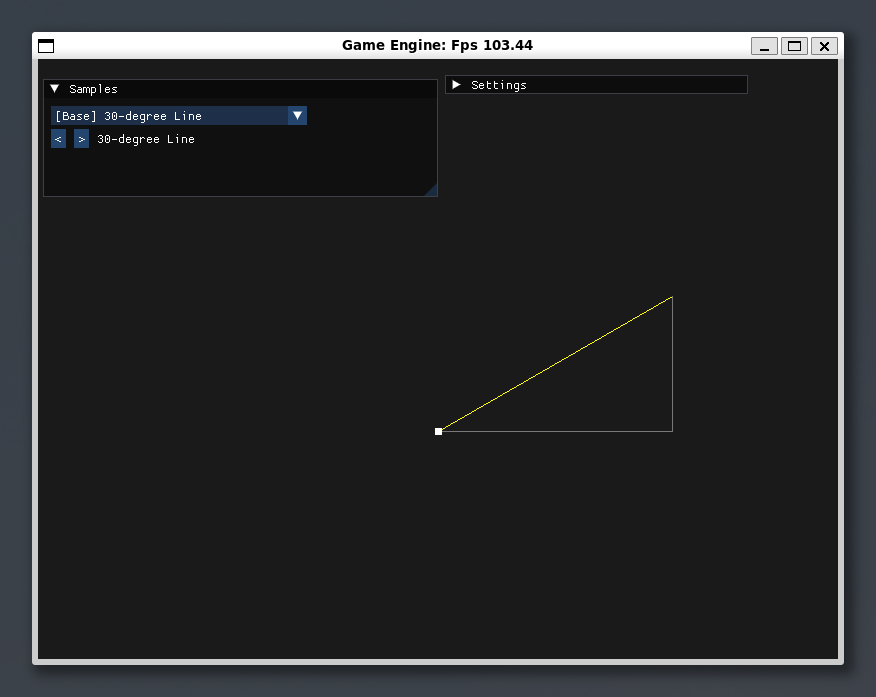
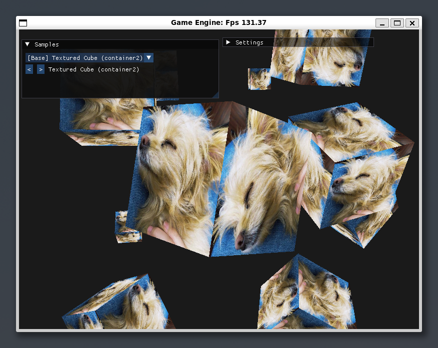
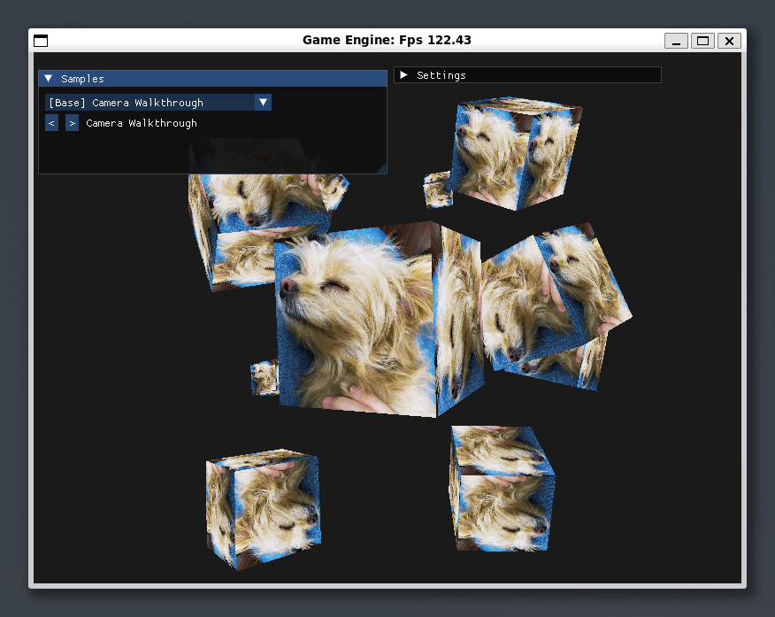
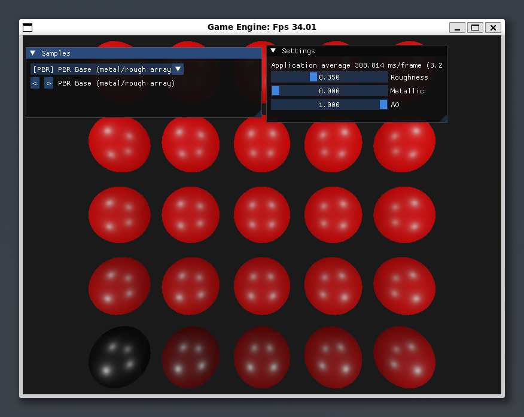
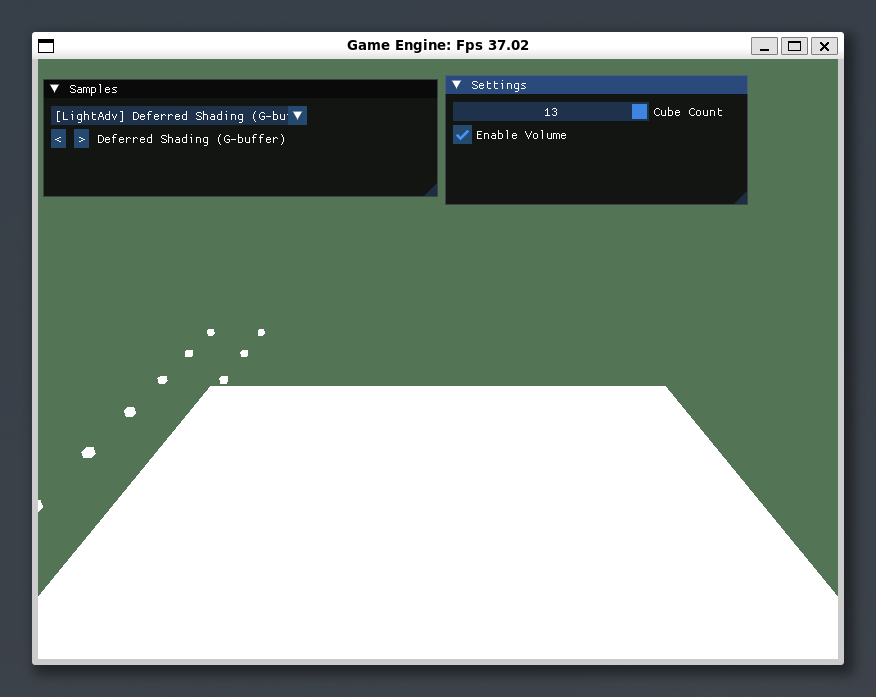
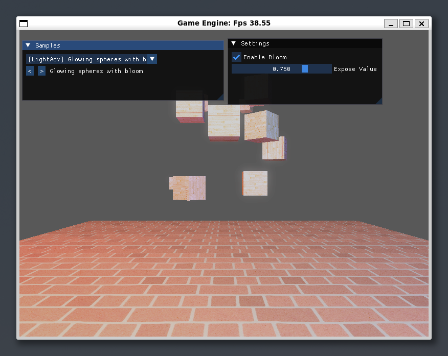
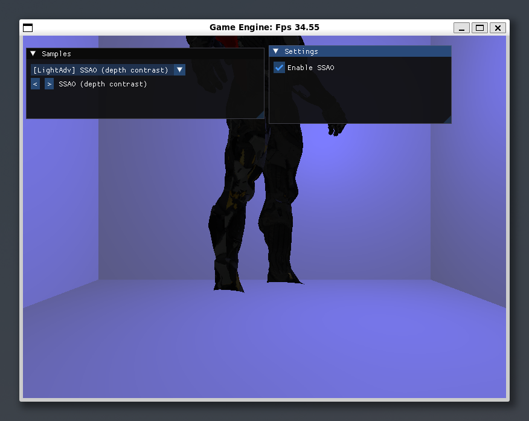
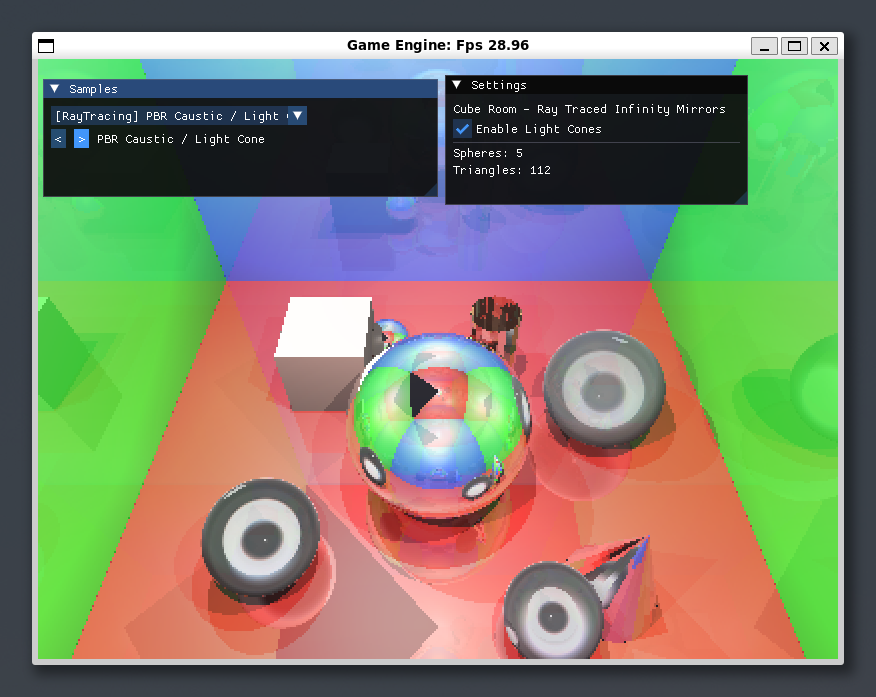

<div align="center">

# SoftGameEngine

**C++20 软件光栅化渲染引擎 —— 纯 CPU 实现，零 GPU 依赖**

[](https://isocpp.org/)
[](https://cmake.org/)
[](LICENSE)
[]()

</div>

---

## 项目简介

SoftGameEngine 是一个从零实现的软件渲染引擎，所有图形管线（光栅化、光照、阴影、PBR、光线追踪）均在 CPU 上完成，SDL2 仅负责窗口创建与像素上屏，Dear ImGui 用于调试面板。

核心目标：**深入理解图形学原理，不依赖任何 GPU API**。

### 技术亮点

- **纯软件光栅化** — 顶点变换、光栅化、片段着色全部 CPU 实现
- **多光照模型** — Ambient / Diffuse / Specular / Blinn-Phong / PBR
- **阴影系统** — Shadow Map (2D) / Cube Shadow Map / PCF 软阴影
- **高级渲染** — Normal Mapping / Parallax Mapping / HDR Tonemapping / Bloom / SSAO / Deferred Shading
- **PBR 材质** — Metallic-Roughness 工作流 + IBL 环境光照
- **光线追踪** — 球体/三角形求交、反射/折射、Schlick 菲涅尔、光锥体积效果
- **41 个示例场景** — 严格对标 [GraphicsAPILearn](https://github.com/GetEducated/GraphicsAPILearn) 课程体系

---

## 效果展示

<table>
  <tr>
    <td align="center"><strong>30° Line</strong></td>
    <td align="center"><strong>Textured Cube</strong></td>
    <td align="center"><strong>Camera Walkthrough</strong></td>
    <td align="center"><strong>PBR Base</strong></td>
  </tr>
  <tr>
    <td></td>
    <td></td>
    <td></td>
    <td></td>
  </tr>
  <tr>
    <td align="center"><strong>Deferred Shading</strong></td>
    <td align="center"><strong>Bloom</strong></td>
    <td align="center"><strong>SSAO</strong></td>
    <td align="center"><strong>Ray Tracing Caustic</strong></td>
  </tr>
  <tr>
    <td></td>
    <td></td>
    <td></td>
    <td></td>
  </tr>
</table>

> 完整截图共 41 张，详见 [`assets/imgs/`](assets/imgs/) 目录。

---

## 快速开始

### 环境要求

| 依赖 | 版本 | 说明 |
|------|------|------|
| C++ 编译器 | Clang 16+ / GCC 13+ | 需完整 C++20 支持 |
| CMake | 3.20+ | 构建系统 |
| SDL2 | 2.0+ | 窗口与输入 |
| Dear ImGui | v1.90+ | 调试 UI（已内置） |
| GoogleTest | - | 单元测试（自动拉取） |

### 构建

```bash
# 一键构建并运行
scripts/buildandrun.sh

# 或手动构建
cmake -B build -S .
cmake --build build -j$(nproc)

# 离线环境（gtest 拉取失败时，指向本地源码）
cmake -B build -S . -DFETCHCONTENT_SOURCE_DIR_GOOGLETEST=<gtest-src>
```

可选 CMake 选项：

| 选项 | 默认 | 说明 |
|------|------|------|
| `SGE_NATIVE_ARCH` | `ON` | 启用 `-march=native`（AVX2/FMA 自动向量化） |
| `ENABLE_SANITIZER` | `OFF` | 开启 ASan + UBSan |

### 运行

```bash
./build/src/soft-game-engine              # 交互窗口
SGE_MAX_FRAMES=30 ./build/src/soft-game-engine   # 无头确定性冒烟测试
SGE_TEST_BARS=1   ./build/src/soft-game-engine   # 通道诊断色带
```

### 操作方式

| 按键 | 功能 |
|------|------|
| `W` `A` `S` `D` | 水平平移 |
| `R` / `F` | 上升 / 下降 |
| `←` `→` | 水平转向 |
| `[` / `]` | 切换场景 |
| `F12` | 截图导出 PPM |

---

## 示例场景库

共 **41 个场景**，严格按 [GraphicsAPILearn](https://github.com/GetEducated/GraphicsAPILearn) `AppType` 枚举顺序排列，渲染参数从参考源码逐项对齐。

### Base — 基础图形

| # | 场景 | 要点 |
|---|------|------|
| 01 | 30-degree Line | NDC 红蓝绿三角 |
| 02 | Triangle (vertex color) | 四角红蓝绿白 |
| 03 | Textured Rect | dog.jpg 正立直出 |
| 04 | Simple Texture | dog.jpg 正立直出 |
| 05 | Textured Cubes | 10 狗图立方体阵 fov45 自转 |
| 06 | Camera Walkthrough | 同上可漫游 fov60 |

### Light — 光照系统

| # | 场景 | 要点 |
|---|------|------|
| 07 | Ambient Light | 铜球 0.2·白光+灯泡标记 |
| 08 | Diffuse Light | 光位 (1,1,1.5) amb0.3 |
| 09 | Specular Light | 轨道光 r=5 amb.1 spec.5 |
| 10 | Material Ramp | 5 球强度 v=(i+1)/5 cam z=6 |
| 11 | Light Map | container2 双贴图 cube@(1,0,0) |
| 12 | Directional Casters | 125 格阵 dir(-.2,-1,-.3) |
| 13 | Point Casters | 轨道点光衰减 |
| 14 | Spot Casters | cos12.5°/17.5° 软边 |
| 15 | Multiple Sources | dir+4 点光+聚光组合 |

### Model & Advanced — 模型与高级特性

| # | 场景 | 要点 |
|---|------|------|
| 16 | Load Model | nanosuit.obj unlit 直出 |
| 17 | Depth Test Grid | 64 大理石箱深度灰度化 |
| 18 | Alpha Blend Windows | 参考 5 窗位排序 |
| 19 | Backface Culling | 45° 单箱剔除开关 |
| 20 | FrameBuffer Post FX | 64 容器箱反相/灰度/锐化 |
| 21 | Skybox 6-face | 六面 jpg cubemap 射线采样 |
| 22 | Simple Geometry | 四角彩色小房子+白顶 |
| 23 | Explode | 渐变球面法线呼吸爆炸 |
| 24 | Normal Lines | 红线框球+黄法线刺 |
| 25 | Instanced Sphere Grid | 红梯度线框球海 |
| 26 | Saturn Ring System | 岩石环公转 |
| 27 | Anti-aliasing (2x SSAA) | dog cube+灰度开关 |

### LightAdv — 高级光照

| # | 场景 | 要点 |
|---|------|------|
| 28 | Blinn-Phong vs Phong | wood 地板 pow32/8 切换 |
| 29 | Gamma Correction | wood 地板 5 彩光横排 |
| 30 | Spot Shadow + PCF | PCF 半径 0-4 可调 |
| 31 | Point Cube Shadow | 房间盒+z 振荡点光 |
| 32 | Normal Mapping | brickwall 光(0,0,1) |
| 33 | Parallax Mapping | bricks2 steep h=0.1 |
| 34 | HDR Corridor | 反法线长廊+1-exp 曝光 |
| 35 | Bloom | 10 木箱+4 彩灯泛光 |
| 36 | Deferred Shading | G-buffer+彩虹灯阵 |
| 37 | SSAO Contact Shadows | 房间盒+模型接触暗化 |

### PBR & RayTracing — 物理渲染与光线追踪

| # | 场景 | 要点 |
|---|------|------|
| 38 | PBR Base | 25 球 red ramp metal/rough 可调 |
| 39 | PBR Textured | rusted_iron 五件套 |
| 40 | IBL Irradiance | loft.hdr 环境+背景 |
| 41 | PBR Caustic / Light Cone | 光锥体积+折射焦散 |

---

## 项目结构

```
SoftGameEngine/
├── src/
│   ├── Core/           # 线性代数、数学工具
│   ├── Render/         # 光栅化器、光线追踪器、帧缓冲
│   ├── Pipeline/       # 渲染管线（变换、裁剪、透视除法）
│   ├── Samples/        # 41 个示例场景
│   └── main.cpp        # 入口
├── test/               # 单元测试（Math + Render）
├── tools/              # 性能基准工具
├── assets/
│   ├── imgs/           # 场景截图（41 张）
│   └── golden/         # 黄金图像基线
├── external/           # 第三方依赖
├── scripts/            # 构建脚本
└── CMakeLists.txt
```

---

## 质量保证

### 单元测试

```bash
# 运行全部测试
cd build && ctest

# 运行渲染相关测试
./test/render_RayTrace     # 光线追踪 4/4
./test/render_Shadow       # 阴影映射
./test/render_PipelineTest # 渲染管线
# ... 共 21 个测试套件
```

### 黄金图像比对

```bash
cd build && ctest -R golden_image
```

渲染结果与预存基线逐像素比对，确保回归安全。基线说明见 [`assets/golden/README.md`](assets/golden/README.md)。

### 性能基准

```bash
./build/tools/bench_raster
```

---

## 技术细节

### 光线追踪器

- **求交**：球体解析解 + 三角形 Moller-Trumbore
- **材质**：漫反射 / 镜面反射 / Schlick 菲涅尔折射 / 全内反射
- **阴影**：逐光源独立遮挡测试 + 动态偏移（避免阴影痤疮）
- **加速**：场景 AABB 包围盒 + 降采样渲染 + 递归深度控制
- **特效**：光锥体积采样 + 距离衰减

### 光栅化管线

- 顶点变换 → 裁剪 → 透视除法 → 视口映射 → 扫描线光栅化
- 深度测试 / 模板测试 / Alpha 混合
- 纹理采样（最近邻 / 双线性 / mipmap）
- 多 render target（G-buffer for Deferred Shading）

---

## 已知简化

- MSAA 以 2x/4x 盒滤波超采样等效实现（可切档）
- IBL 为真实 split-sum 实现（余弦加权辐照度卷积 + 三档预滤波 mip + Karis 解析 BRDF）
- 模型经 MTL diffuse 图集渲染（unlit，与参考一致）

---

## 贡献

欢迎提交 Issue 和 Pull Request！

1. Fork 本仓库
2. 创建特性分支 (`git checkout -b feature/amazing-feature`)
3. 提交更改 (`git commit -m 'Add amazing feature'`)
4. 推送到分支 (`git push origin feature/amazing-feature`)
5. 创建 Pull Request

---

<div align="center">

**如果这个项目对你有帮助，请给个 Star !**

</div>
